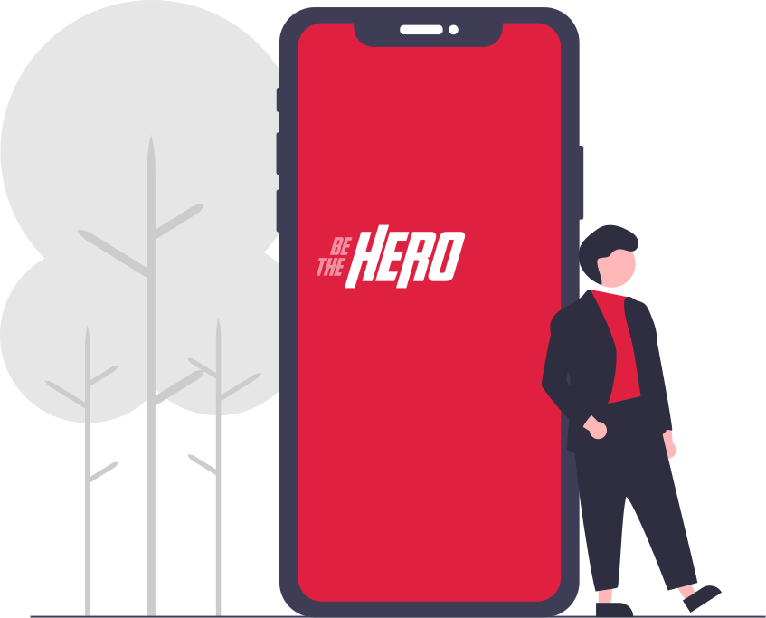

<h1 align="center">
    
</h1>

<p align="center">
  <a href="#rocket-tecnologias">🚀 Tecnologias</a>&nbsp;&nbsp;&nbsp;|&nbsp;&nbsp;&nbsp;
  <a href="#-projeto">💻 Projeto</a>&nbsp;&nbsp;&nbsp;|&nbsp;&nbsp;&nbsp;
  <a href="#-backend">🔨 Backend</a>&nbsp;&nbsp;&nbsp;|&nbsp;&nbsp;&nbsp;
  <a href="#-frontend">🌐 Frontend</a>&nbsp;&nbsp;&nbsp;|&nbsp;&nbsp;&nbsp;
  <a href="#-mobile">📱 Mobile</a>&nbsp;&nbsp;&nbsp;|&nbsp;&nbsp;&nbsp;
  <a href="#-como-contribuir">🤔 Como contribuir</a>&nbsp;&nbsp;&nbsp;|&nbsp;&nbsp;&nbsp;<br>
  <a href="#-como-executar">🔖 Como executar</a>&nbsp;&nbsp;&nbsp;|&nbsp;&nbsp;&nbsp;
    <a href="#memo-licença">🧾 Licença</a>
</p>

## 🚀 Tecnologias

Esse projeto foi desenvolvido com as seguintes tecnologias:

- [Node.js](https://nodejs.org/en/)
- [React](https://reactjs.org)
- [React Native](https://facebook.github.io/react-native/)
- [Expo](https://expo.io/)
- [Jest](https://jestjs.io/)
- [Celebrate](https://github.com/arb/celebrate)

## 🌐 Frontend

<h1 align="center">



</h1>

## 🔖 Como Executar

#### Clonando o projeto
```sh
git clone https://github.com/victor47n/BeTheHero.git
cd BeTheHero
npm install
```
#### Iniciando Backend
```sh
cd backend
npm start
```
#### Iniciando Frontend
```sh
cd frontend
npm start
```
#### Iniciando mobile
```sh
cd mobile
npm start
```
## :memo: Licença

Esse projeto está sob a licença MIT. Veja o arquivo [LICENSE](LICENSE.md) para mais detalhes.

---

Feito com ❤️ by **victor47n**
